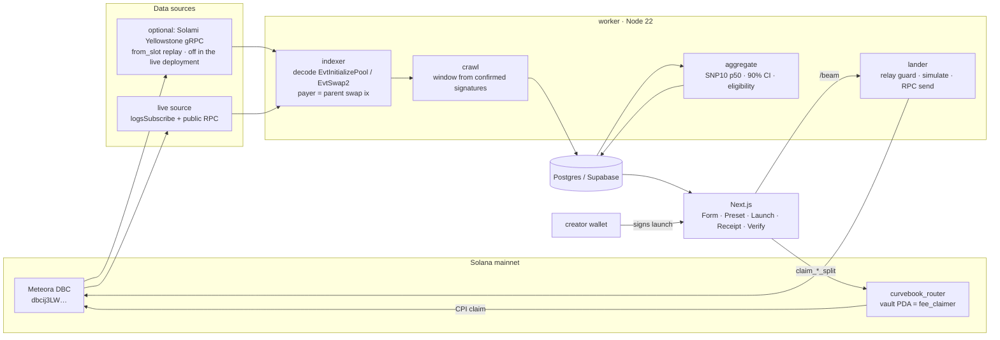

# Architecture

Curvebook has one flow: **pick** a curve by its measured form → **launch** on it → **watch** the new pool's first 10 slots.

## Packages
| Path | What it is |
|---|---|
| `core/` | Pure TypeScript shared by everything: DBC event-CPI decoder with payer pairing (`decode.ts`), PoolConfig decoding and the SDK-exact fee scheduler (`config.ts`), plain-language readout (`describe.ts`), the 10-slot window and SNP10 (`window.ts`), Form statistics with seeded bootstrap CIs (`stats.ts`), `buildLaunchTx` (`launch.ts`), preset definitions (`presets.ts`), router client (`router.ts`) |
| `program/` | `curvebook_router` Anchor program — see `docs/AUDIT-SCOPE.md` |
| `worker/` | Long-lived indexer + lander. Two sources (keyless logs, live; optional Solami gRPC), one finalization path, aggregator, `/beam` + `/health` HTTP |
| `web/` | Next.js App Router UI and API routes |
| `scripts/` | `pnpm proof` chain, preset deploy, claim crank, localnet rehearsal, spikes |
| `db/schema.sql` | The whole schema; the worker applies it on start |

## The metric (frozen)
- **Open slot `s_open`.** Slot activation: `max(creation slot, activation point)`. Timestamp activation: the creation slot if already active, else the slot of the first swap whose block timestamp reached the activation point.
- **Window.** Slots `s_open … s_open + 9`.
- **SNP10.** Σ base bought in the window by wallets other than `EvtInitializePool.creator`, ÷ `PoolConfig.swap_base_amount`.
- **Buyer.** `EvtSwap2` carries no payer. The buyer is the `payer` account of the DBC `swap`/`swap2` instruction that emitted the event, top-level or inner (aggregators, bots). Unpaired buys count as outside buys.
- **Ranking.** A config is ranked only with ≥ 20 complete windows from ≥ 5 distinct creators, by SNP10 median ascending; ranks tie when 90% bootstrap CIs overlap.
- **Limitation.** Wallets funded by the creator count as outsiders. SNP10 measures supply bought by wallets that are not the creator's signing key.

## Why windows are finalized from the confirmed ledger
The gRPC stream runs at `PROCESSED` so the receipt strip fills while it happens. The window that counts is re-read from
`getSignaturesForAddress(pool)` + `getTransaction` once `s_open + 10 + 32` slots have passed. A processed transaction dropped by
a fork can't reach the Form, and a stream gap can't leave a window short: a window whose crawl did not reach the creation slot is
stored with `complete = false` and excluded from statistics. The same path runs in keyless mode, so both sources produce identical
windows (`worker/test/grpc.test.ts` proves the decoder sees the same events from both wire shapes).

## Landing a launch
1. `POST /api/launch/build` → `buildLaunchTx`: `getPoolConfig` → SDK quote of the creator's bundled buy at slot 0 (sets `minimumAmountOut`; throws if the curve can't absorb it) → `createPoolWithFirstBuy` → v0 message, signed by a fresh base-mint key. Its message hash is stored with a 90 s expiry.
2. The creator's wallet signs.
3. `POST /beam` on the worker: refuses any transaction whose message hash it did not issue (not an open relay), simulates, sends via RPC (or the optional Solami Beam adapter), resends the **same bytes** until confirmed or the blockhash expires — a retry can never create a second pool.

## Royalties
The preset's DBC config names the router vault as `fee_claimer`. Anyone cranks `claim_creation_split` / `claim_trading_split`;
the router CPIs the DBC claim and splits author / treasury in the same instruction. Verified on localnet against the real DBC
program: the decoded partner fee equals `getPoolFeeBreakdown().partner.totalQuoteFee` (S8), and DBC's unclaimed partner fee
falls by exactly the split amount (I6).
