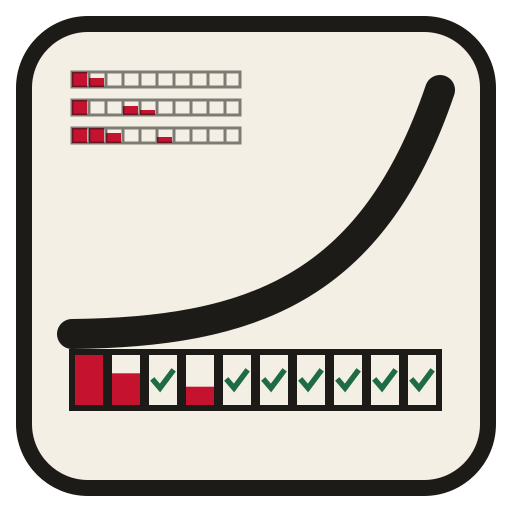
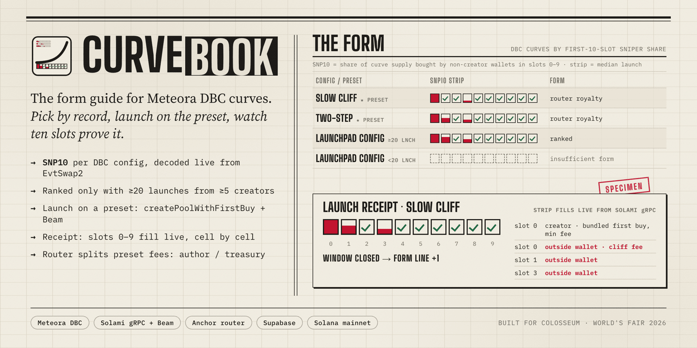
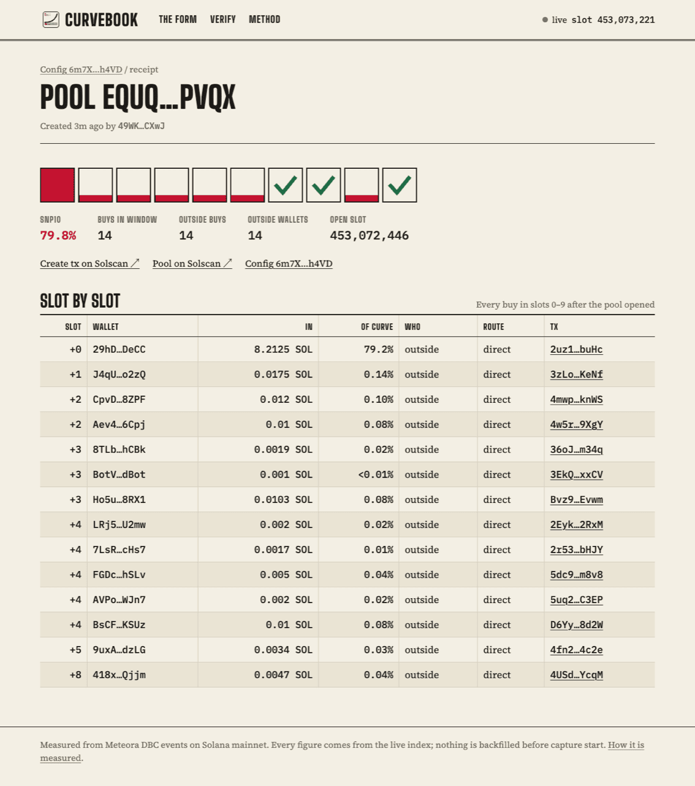

<div align="center">
  
  <h1>Curvebook</h1>
  <p><em>The form guide for Meteora DBC curves: how much of every launch outside wallets buy in its first ten slots,<br/>and a launch button on the curves with the best record.</em></p>
  

  <br/>

  [](https://curvebook.edycu.dev)
  [](JUDGE.md)
  [](DEMO.md)
  [](https://colosseum.com/worldsfair)

  **[Demo video (2:39)](https://youtu.be/DGLbhdIFg8Q)** · **[Pitch video (1:38)](https://youtu.be/5uSudutu9OQ)** · [Landing page](https://curvebook.edycu.dev/landing) · [Pitch deck](https://curvebook.edycu.dev/pitch)

  <br/>

  
  
  
  
  
  
  

  <br/>

  [](https://github.com/edycutjong/curvebook/actions/workflows/ci.yml)
  [](https://github.com/edycutjong/curvebook/actions/workflows/codeql.yml)
  [](https://github.com/edycutjong/curvebook/actions/workflows/gitleaks.yml)
  

</div>

---

## 📸 See it in action

<div align="center">
  
</div>

> **Pick → launch → watch.** Rank DBC curves by what snipers took in their first 10 slots, launch on a preset from your own wallet,
> and watch your pool's ten cells fill in as the slots confirm.
> *Above: a real mainnet pool from the first half hour of capture. One outside wallet bought 79.2% of the curve in slot 0.*

---

## 💡 The problem & the solution

Every Meteora Dynamic Bonding Curve launchpad picks a curve and a fee schedule **blind**. The curve decides how much supply snipers can take in the
seconds after a pool opens, and nobody publishes that number. Meteora has no DBC data API; its docs tell integrators to index `EvtSwap2` themselves.

**Curvebook** indexes every DBC launch on mainnet and publishes, per config, **SNP10**: the share of the curve's sellable supply bought by
wallets other than the creator in slots 0–9. In the first 30 minutes of capture, outside wallets bought in 46 of 75 launch windows, and the
worst gave up **90.7%** of its curve in slot 0 ([DEMO.md](DEMO.md)).

- 📊 **The Form**: configs ranked by median SNP10 with 90% bootstrap CIs, eligible only at ≥ 20 windows from ≥ 5 creators, so a config can't be farmed cheaply.
- 🧾 **Live receipt** for any pool: ten cells, slot by slot, every buy with its wallet, amount, share of curve and route (direct / CPI).
- 🚀 **Launch on a preset**: `createPoolWithFirstBuy` with an SDK-quoted slippage guard, signed in your wallet, landed by a relay that only lands what it issued.
- 💸 **Royalty router**: each preset's DBC `fee_claimer` is a `curvebook_router` PDA. The sniper tax on a preset funds its author, split on-chain.
- 🧩 **Composable**: a launchpad calls `buildLaunchTx` from its own backend ([`examples/launch-on-preset.ts`](examples/launch-on-preset.ts)); royalties still flow, because they are enforced by the config, not by our UI.

## 🔬 The metric (frozen; also on the in-app method page)

- **Open slot.** Slot activation: `max(creation slot, activation point)`. Timestamp activation: the first swap at or after the activation time.
- **SNP10.** Σ base bought in slots `s_open … s_open+9` by wallets ≠ `EvtInitializePool.creator`, ÷ `PoolConfig.swap_base_amount`.
- **Buyer.** `EvtSwap2` has **no payer field**. We pair each event-CPI with the DBC `swap`/`swap2` instruction that emitted it, top-level or
  inside an aggregator or bot, and read that instruction's `payer` account.
- **Finality.** Windows are re-read from the pool's *confirmed* signatures once `s_open + 42` has passed. A window counts only if the crawl reached the pool's creation transaction.
- **Limitation.** A wallet the creator funded counts as outside. SNP10 measures supply that left the creator's key, not intent.

## 🏗️ Architecture

| Layer | What | Where |
|---|---|---|
| Decode | DBC event-CPI → `EvtInitializePool` / `EvtSwap2` / `EvtCurveComplete` + payer pairing; v0 and v1 transactions | [`core/src/decode.ts`](core/src/decode.ts) |
| Index | RPC Fast Yellowstone gRPC with `from_slot` replay (the live deployment), keyless `logsSubscribe` fallback; windows finalized from confirmed signatures | [`worker/`](worker/src) |
| Rank | SNP10 median, p90, seeded 1,000-resample bootstrap CI, D9 eligibility, tie when CIs overlap | [`core/src/stats.ts`](core/src/stats.ts) |
| Launch | `buildLaunchTx`: `getPoolConfig` → `getQuoteFromInputAmount` → `createPoolWithFirstBuy` → v0 tx | [`core/src/launch.ts`](core/src/launch.ts) |
| Land | relay guard (message hash issued + single use) → simulate → RPC send (optional Beam adapter) → same-bytes resend | [`worker/src/lander.ts`](worker/src/lander.ts) |
| Royalties | `curvebook_router`: `register_preset`, `claim_trading_split`, `claim_creation_split`, `set_split` | [`program/`](program/programs/curvebook_router/src) · [audit scope](docs/AUDIT-SCOPE.md) |
| UI | Next.js 15: The Form, preset page with toll row, launch, receipt, `/integrations/verify`, `/judge` | [`web/`](web/app) |

Diagram and design notes: [ARCHITECTURE.md](ARCHITECTURE.md).

## 🏆 Sponsor integration

**Meteora DBC is the engine.** Without it there is no curve to rank. Calls in the code: `createConfig`, `createPoolWithFirstBuy`, `getPoolConfig`,
`getQuoteFromInputAmount`, `getPoolFeeBreakdown`, `swap`, `buildCurve` / `buildCurveWithTwoSegments` / `buildCurveWithLiquidityWeights`,
`deriveDbcPoolAddress`, `deriveDbcTokenVaultAddress`, plus on-chain CPI of `claim_trading_fee` and `claim_partner_pool_creation_fee`, and event
decoding against IDL 0.2.1. Friction we hit is written up in [docs/DX-REPORT.md](docs/DX-REPORT.md).

**The live worker runs on [RPC Fast](https://rpcfast.com)** (since 8 Oct 2026, 21:09 UTC). It streams every DBC transaction over RPC Fast's
Yellowstone gRPC, with `from_slot` replay after a reconnect or a redeploy ([`grpc.ts`](worker/src/sources/grpc.ts)), and makes its JSON-RPC calls
to RPC Fast with an `x-token` header ([`rpc.ts`](worker/src/rpc.ts)). If RPC Fast stops accepting the key (the plan ends), the worker moves itself
to public RPC instead of stalling. The gRPC decoder is tested to produce exactly the events `getTransaction`
produces on real mainnet fixtures. Without `GRPC_URL` the worker runs keyless, as it did from 4 Oct until the switch: public `logsSubscribe`
plus confirmed signatures.
Launches land with plain `sendTransaction`; an optional Beam landing adapter ([`lander.ts`](worker/src/lander.ts)) is off.

## 🚀 Getting started

```bash
pnpm install
docker compose up -d db                 # Postgres 16 on :5433
pnpm worker                             # live mainnet index, no keys needed
pnpm web                                # http://localhost:3000
```
Optional: `cp .env.example .env` and set `GRPC_URL` / `GRPC_TOKEN` (any Yellowstone gRPC provider; we use RPC Fast) and `RPC_URL` / `RPC_TOKEN`. On-chain: `cd program && pnpm install && pnpm test`.

Reproduce the numbers: `pnpm proof` (snapshot → offline recompute → 20 sampled buys re-fetched from mainnet). Rehearse the launch path:
`bash scripts/localnet.sh` then `pnpm rehearse`.

## 🧪 Testing & CI

**717 tests, with 100% statement, branch, function and line coverage** on every `core`, `worker` and `web/lib` source file (thresholds enforced in CI; pages and routes are covered by the e2e suite), plus property checks over
**30,000 random windows** and **20,000 random fee schedules × 10 slots** (our formula equals the Meteora SDK's own scheduler at every point):

| Suite | Count | Coverage | What it pins |
|---|---|---|---|
| core (vitest) | 171 | 100% | decoding real mainnet txs (incl. CPI-routed and v1), SNP10 window, Form stats, SDK toll quotes for every preset, launch builder, router client, properties |
| worker (vitest) | 251 | 100% | crawl paging, indexer finalize paths, gRPC ≡ RPC decode on real fixtures, relay permission boundary, lander, RPC backoff, HTTP API, defect-named regressions |
| web lib (vitest) | 268 | 100% | formatters, strip scaling, Form grouping, launch validation, DB queries (Postgres mocked) |
| program (Rust) | 8 | — | I2 split exactness incl. a 100k-case sweep, DBC discriminators and PDAs |
| program (localnet, real DBC binary) | 19 | — | invariants I1–I6, every negative path |
| e2e (Playwright) | 23 | — | smoke, `/judge` with no session, Form → config → receipt, 375 / 768 / 1440 layout |

Pipeline ([`.github/workflows`](.github/workflows)): Quality (lint · typecheck · tests · Rust) → Security (dependency audit, CodeQL, gitleaks over full history) →
Build (web + worker Docker image, bundle budget) → E2E on a recorded mainnet snapshot → Lighthouse → deploy gate. Dependabot and conventional-commit releases.

## 📁 Project structure

```
core/       shared TS: decoder, metric, stats, fee schedule, launch builder, router client
worker/     indexer + aggregator + lander (Dockerfile)
web/        Next.js app + API routes + Playwright
program/    curvebook_router (Anchor) + localnet tests against the real DBC program
scripts/    proof chain, preset deploy, claim crank, localnet rehearsal, e2e launch, spikes
db/         schema.sql
fixtures/   committed mainnet snapshot + rehearsal output
docs/       AUDIT-SCOPE, DX-REPORT, spike notes, images
```

## 🧭 Status, honestly

- The index runs live on mainnet, and the three presets are **live on mainnet** with one own launch each ([DEMO.md §1b](DEMO.md)). `curvebook_router` runs on **devnet**, where the full launch → claim → on-chain split path is on the explorer ([DEMO.md §3b](DEMO.md)); it is not on mainnet yet (≈ 1.6 SOL of refundable rent).
- The index covers launches since capture start. There is no backfill: gRPC replay reaches ~23 minutes back, by design.
- Pre-existing code: none. This repository was started on 2026-10-04 for Colosseum World's Fair.

## 📄 License
[MIT](LICENSE) © 2026 Edy Cu

## 🙏 Acknowledgments
Built for Colosseum World's Fair 2026. Thanks to Meteora for DBC and its SDK, and to RPC Fast for the Yellowstone gRPC stream and RPC the live indexer runs on (Hackathon plan).
